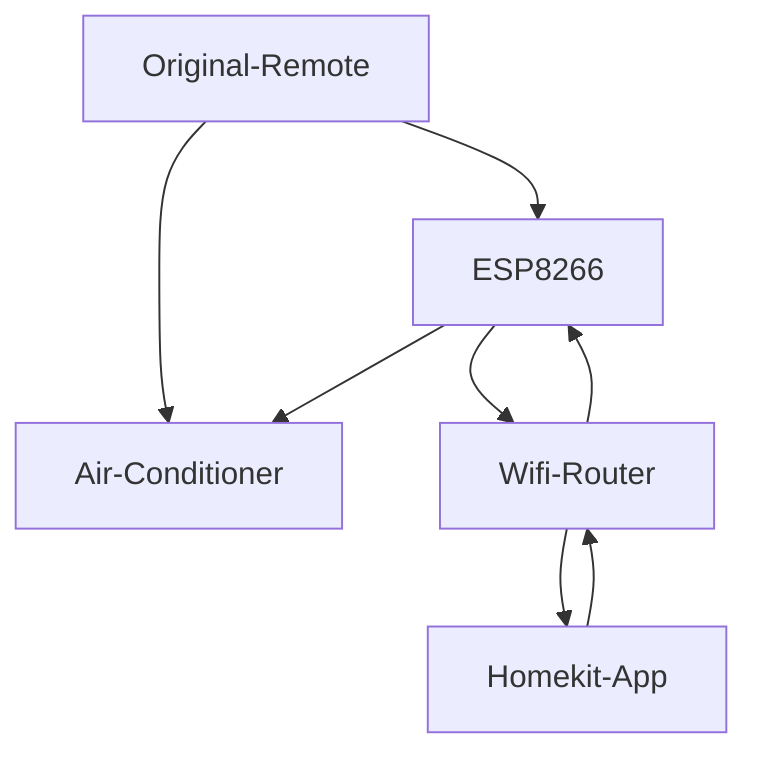

# Homekit_Air_Conditioner

  

### WiFi配网

1. 上电后, ESP8266在未联网/断网时LED 2/S闪烁, 生成ESP_XXXXXX的热点, XXXXXX是8266芯片的MAC.
2. 手机连接该热点, 自动弹出配网页面，ios 版本不同自动弹出的时间不同, 12.5以下很快就弹出配网页面, 15.0以上要等很长时间. 如果未自动弹出可手动访问192.168.4.1
3. Configure WiFi, 选择 WiFi，输入密码, Save，连接成功后会自动退出配网模式并关闭 ESP_XXXXXX 热点.

 

### Add accessories 添加 HomeKit 配件

* Homekit 配对码: 11111111
* [Add accessories](https://support.apple.com/en-us/HT204893)

 
 

### 空调功能

1. Apple Homekit App 空调功能: 开机, 关机, 制冷, 制热, 风速, 当前环境温湿度显示. 
 基于 [HomeKit Accessory Protocol Specification(Noncommercial Version) Release R2](https://developers.apple.com/homekit/faq) , 有 *`此配件尚未经过认证可与Homekit配合使用， 因此部分功能可能不可用。`* 字样. 
2. 如果需要出门在外时远程控制 HomeKit 配件, 请将 HomePod、HomePod mini、Apple TV 或 iPad  [设置为家居中枢. ](https://support.apple.com/zh-cn/HT207057)
3. 红外信号反馈: 普通空调遥控器进行 开机, 关机, 制冷, 制热, 风速等 Apple Homekit 协议支持的动作时, Homekit App 会同步更新状态. 

 
 

### IO0 按键定义

1. 空调遥控识别: 按下 IO0 按键5S, LED 2/S 闪烁, 松开按键, 15S 内普通空调遥控器对准此项目上的遥控接收头(IR_R)按一下开关机键, 等待 LED 闪烁停止. IRremoteESP8266 库, 支持市场上绝大多数空调品牌.
2. 抹除 Homekit 配对信息: 按下 IO0 按键 10S, LED 2/S 闪烁, 4/S 闪烁, 松开按键, 抹除 Homekit 配对信息.
3. 恢复设置: 按下 IO0 按键 15S, LED 2/S 闪烁, 4/S 闪烁, 8/S 闪烁, 松开按键, 抹除 Homekit 配对信息, 抹除 Wifi 连接信息, 抹除空调遥控识别信息.

### ESP8266 PIN引脚定义

| IR_T | 红外发射 |IO14|
| :---: | :---: |:---: |
|**IR_R** | **红外接收** |**IO12**|
|**LED** |**指示灯** |**IO2**|
|**Button**|**按键** |**IO0** |

# Thanks
* [HomeKit Accessory Protocol Specification(Noncommercial Version) Release R2](https://developers.apple.com/homekit/faq)
* [arduino-SHTC3](https://github.com/ludiazv/arduino-SHTC3) 
* [WiFiManager](https://github.com/tzapu/WiFiManager)
* [IRremoteESP8266](https://github.com/crankyoldgit/IRremoteESP8266) 
* [Arduino-HomeKit-ESP8266](https://github.com/Mixiaoxiao/Arduino-HomeKit-ESP8266) 
* [arduino-button-long-press-short-press](https://arduinogetstarted.com/tutorials/arduino-button-long-press-short-press)

  
 

